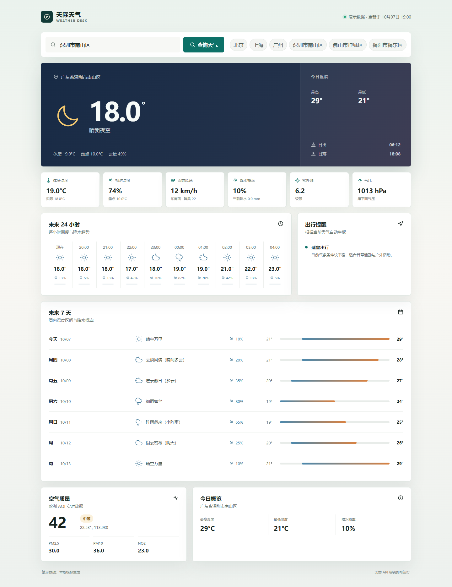

# 天际天气

一个基于 Flask 的桌面天气查询与可视化项目，使用本地模拟数据展示完整的天气查询流程。项目无需 API Key、无需注册第三方账号，克隆后即可运行。


## 界面预览



## 项目简介

本项目是一套较为完整的天气查询应用。用户输入城市或地区后，程序先生成地点结果，再根据固定坐标生成当前天气、逐小时趋势、未来七天预报、空气质量和出行建议。由于面试需要，无法在此呈现真实天气数据，故采取虚构数据来呈现该项目。

项目重点不在于调用真实天气接口，而在于展示以下能力：

- Flask 路由处理和表单交互
- 前后端数据传递与 Jinja2 模板渲染
- 天气数据结构转换和派生指标计算
- 多地点选择流程
- 响应式桌面仪表板设计
- 模块化 Python 项目结构
- 无密钥、离线可运行的演示方案

## 应用场景

这个项目可以用于大学生校园生活和日常出行前的快速判断：

- 查看上课、通勤或回宿舍时是否需要携带雨具
- 根据温度和紫外线安排室外运动或社团活动
- 比较同一城市不同区域的天气
- 展示如何把复杂气象数据整理成桌面仪表板
- 作为 Flask、Jinja2、CSS Grid 和前端数据展示的练习项目

## 功能特性

| 功能 | 说明 |
| --- | --- |
| 城市搜索 | 支持输入城市或地区名称 |
| 多地点选择 | 搜索“朝阳”时可演示同名地点选择 |
| 当前天气 | 温度、体感温度、湿度、降水、气压、露点和云量 |
| 24 小时预报 | 展示逐小时温度、天气图标和降水概率 |
| 7 天预报 | 展示每日天气、最低温、最高温和温度区间 |
| 空气质量 | 展示 AQI 等级以及 PM2.5、PM10、NO2 |
| 天文信息 | 展示日出、日落和紫外线等级 |
| 出行建议 | 根据降水、温度、风力、紫外线等自动生成提醒 |
| 演示模式 | 页面明确标识模拟数据，避免与真实天气混淆 |
| 一键启动 | Windows 下双击 `run_demo.bat` 即可运行 |

## 快速开始

### 环境要求

- Python 3.10 或更高版本
- 支持现代浏览器的桌面环境
- 无需 API Key
- 无需联网获取天气数据

### Windows 一键启动

双击项目根目录下的：

```text
run_demo.bat
```

脚本会自动安装依赖、启动 Flask 服务并打开浏览器。

### 命令行启动

```powershell
pip install -r requirements.txt
python weather.py
```

启动后访问：

```text
http://127.0.0.1:5020
```

## 推荐演示流程

| 输入地点 | 演示效果 |
| --- | --- |
| 北京 | 单一地点，直接显示天气结果 |
| 上海 | 单一地点，直接显示天气结果 |
| 广州 | 单一地点，直接显示天气结果 |
| 深圳市南山区 | 显示深圳南山区的固定模拟天气 |
| 佛山市禅城区 | 显示佛山禅城区的固定模拟天气 |
| 揭阳市揭东区 | 显示揭阳揭东区的固定模拟天气 |
| 朝阳 | 返回多个同名地点，演示地点选择流程 |

首页还提供常用地点的快捷查询按钮。

## 系统流程


一次完整查询的处理过程如下：

1. 浏览器通过 `POST` 提交城市或地区名称。
2. Flask 路由调用 `get_locations()` 获取模拟地点列表。
3. 如果只有一个地点，程序自动选中。
4. 如果有多个地点，页面显示地点选择列表。
5. 程序根据坐标生成当前天气、逐小时预报和 7 天预报。
6. `weather_processing.py` 转换天气代码、计算温度区间并生成出行建议。
7. Jinja2 将处理后的数据渲染到天气仪表板。

## 项目结构

```text
weather.py                  Flask 路由和程序入口
weather_service.py          对外提供地点、天气和空气质量数据
demo_data.py                模拟地点和天气数据生成逻辑
weather_processing.py       数据转换、天气映射、统计和出行建议
templates/
    index.html              页面结构
    _icons.html             SVG 天气图标
static/
    styles.css              页面样式
    app.js                  页面交互
requirements.txt            Python 依赖
run_demo.bat                Windows 一键启动脚本
.gitignore                  Git 忽略规则
```

## 核心模块

### weather.py

程序的 Flask 入口，负责：

- 注册首页路由
- 接收表单数据
- 处理单地点和多地点逻辑
- 捕获数据异常
- 调用模板渲染页面

### weather_service.py

业务服务层，提供三个统一接口：

```python
get_locations(city_name)
get_forecast(lat, lon)
get_air_quality(lat, lon)
```

当前实现全部返回模拟数据。后续如果要接入真实天气接口，只需要替换这一层，不需要修改页面渲染逻辑。

### demo_data.py

模拟数据源，负责生成：

- 城市和地区坐标
- 当前天气
- 未来 24 小时逐小时数据
- 未来 7 天每日数据
- 日出日落和紫外线指数
- 空气质量数据

模拟数据会根据地点的经纬度和当前时间动态生成，因此每次运行都会得到合理变化，而不是完全固定的静态文本。

### weather_processing.py

数据处理层，负责：

- WMO 天气代码和中文名称映射
- 风向角度转换
- 紫外线等级和空气质量等级计算
- 24 小时预报整理
- 7 天温度区间计算
- 自动生成出行建议
- 组合最终页面数据

## 技术栈

| 技术 | 用途 |
| --- | --- |
| Python | 后端逻辑和数据处理 |
| Flask | Web 路由和模板渲染 |
| Jinja2 | 服务端页面模板 |
| HTML5 | 页面结构 |
| CSS3 | 响应式布局和视觉设计 |
| JavaScript | 查询按钮状态和轻量交互 |
| SVG | 天气和功能图标 |
| Mermaid | README 系统流程图 |

## 常见问题

### 提示无法识别 python

请先安装 Python，并确保安装时勾选了“Add Python to PATH”。

### 端口 5020 被占用

修改 `weather.py` 最后一行的端口号：

```python
app.run(debug=False, host="127.0.0.1", port=5020)
```

例如将 `5020` 改为 `5030`，然后访问 `http://127.0.0.1:5030`。

### 页面没有天气数据

确认提交了城市名称，并重新启动 `weather.py`。如果页面出现错误提示，请检查 Python 版本是否满足要求。

## 设计过程与问题解决

### 从单文件到模块化

项目最初是一个简单的单文件 Flask 程序。随着功能增加，代码逐渐出现重复和职责不清的问题。本项目重新拆分为路由、数据服务、模拟数据、数据处理和页面资源五个部分，使程序更容易阅读和修改。

### 解决 500 错误

模块拆分后曾出现内部服务器错误。排查发现，数据处理模块中残留了旧的接口函数，覆盖了新的数据服务函数。删除重复定义并重新验证查询流程后，问题得到解决。

### 保证无密钥运行

为了避免在公开仓库中暴露 API Key，项目不再请求真实天气接口，而是使用 `demo_data.py` 本地生成模拟数据。面试官无需注册账号即可运行完整页面。

### 提高页面可读性

页面没有简单堆叠所有指标，而是分成当前天气、实时指标、24 小时趋势、7 天预报、空气质量和出行建议几个区域，方便快速查看重点信息。

## 第三方来源与 AI 使用

- Flask 和 Lucide 的许可证与来源记录在 [THIRD_PARTY_NOTICES.md](THIRD_PARTY_NOTICES.md)。
- 项目开发过程中使用了 Codex 辅助编写和调试代码。
- 所有功能均已实际运行验证，项目作者可以独立运行、修改和讲解程序。

## 后续扩展方向

- 接入真实高德地图和 Open-Meteo API
- 增加地图选点和定位
- 增加天气趋势图表
- 增加多城市收藏和对比
- 使用 SQLite 保存查询历史
- 增加自动化测试和 GitHub Actions
- 部署到云服务器或容器平台

## 提交说明

本 GitHub 仓库只包含程序源代码、运行说明、许可证和项目预览图。个人简介、项目讲解稿、演示脚本和邮件模板等个人材料保存在项目文件夹之外，发送招新邮件时再与项目压缩包一起整理，避免隐私材料进入公开仓库。

## 项目状态

当前版本为离线模拟数据演示版，已完成首页、单地点查询、多地点选择、当前天气、24 小时预报、7 天预报、空气质量和出行建议等功能。项目可在无网络环境下运行，适合直接用于面试展示和 GitHub 提交。
